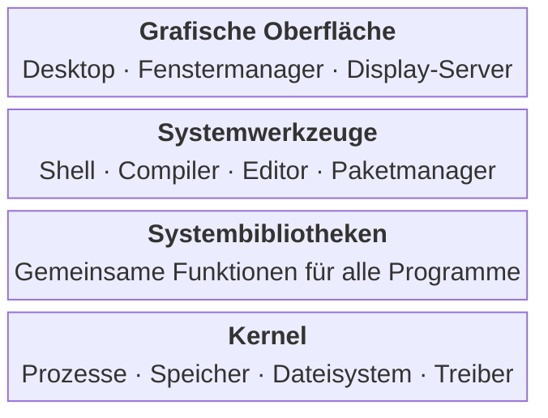

## … in a nutshell

```mermaid
block-beta
  columns 1
  gui["<b>Grafische Oberfläche</b><br>Desktop · Fenstermanager · Display-Server"]
  tools["<b>Systemwerkzeuge</b><br>Shell · Compiler · Editor · Paketmanager"]
  libs["<b>Systembibliotheken</b><br>Gemeinsame Funktionen für alle Programme"]
  kernel["<b>Kernel</b><br>Prozesse · Speicher · Dateisystem · Treiber"]
```
