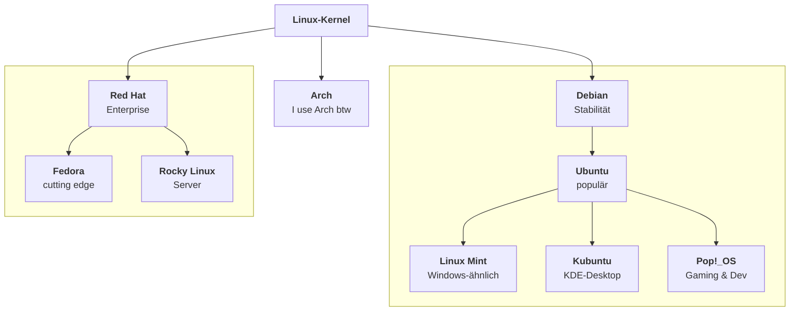

## Linux-Stammbaum

```mermaid
flowchart TB
  kernel["<b>Linux-Kernel</b>"]
  subgraph deb [" "]
    debian["<b>Debian</b><br>Stabilität"] --> ubuntu["<b>Ubuntu</b><br>populär"]
    ubuntu --> mint["<b>Linux Mint</b><br>Windows-ähnlich"] & kubuntu["<b>Kubuntu</b><br>KDE-Desktop"] & pop["<b>Pop!_OS</b><br>Gaming & Dev"]
  end
  subgraph rh [" "]
    redhat["<b>Red Hat</b><br>Enterprise"] --> fedora["<b>Fedora</b><br>cutting edge"] & rocky["<b>Rocky Linux</b><br>Server"]
  end
  kernel --> debian & redhat & arch["<b>Arch</b><br>I use Arch btw"]
```

Note:
Vereinfacht: Es gibt Hunderte Distros. Fedora ist genau genommen der Vorläufer von Red Hat Enterprise Linux, Rocky Linux ein freier Nachbau davon.
